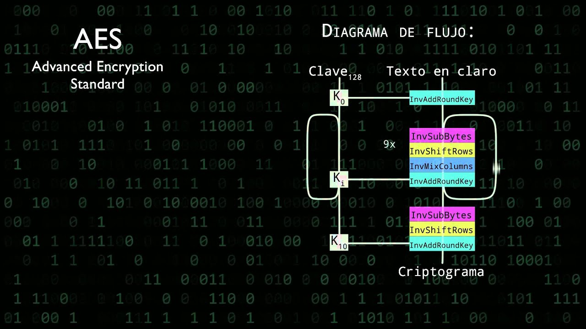

### Introducción:
Este proyecto proviene de un proyecto mayor de una red Docker (https://github.com/carlosfdezdeus/Proyectos-Docker). Esta parte del proyecto se enfocaba en el acceso a los datos de los routers mediante scripts en perl a través de una red docker.

### Acceso a routers:

Para poder acceder a los routers y obtener los datos hubo que replicar peticiones GET y POST. En primera instancia, parece un trabajo simple pero el uso de un encriptado complicó el proceso.  

Primero, buscamos replicar el cifrado con un programa muy conocido, el '**John the Ripper**'. Por desgracia, este no fue capaz de reconocer el cifrado que se utilizaba, por tanto hubo que buscar otra solución. 

Para solucionar el problema, decidimos realizar **ingeniería inversa**, es decir, encontrar los documentos que cifraban la contraseña e intentar replicarlos. Para esto realizamos los siguientes pasos:

1. Buscar los JavaScript que cifran la contraseña.

Esto fue un paso bastante simple ya que los archivos no estaban muy ocultos. Hubo que acceder a las Herramientas de Desarrollador del navegador para poder descargar el código.

2. Entender que cifrado se utiliza.
                    
Finalmente, tras varias lecturas, conseguimos entender que se trataba de un cifrado **AES** *(Advanced Encryption Standard)* **modificado**, por esta razón el 'John the Ripper' no era capaz de detectarlo.

El **AES**, es un algorimo de **cifrado simétrico por bloques**. En el caso del AES convencional, se utilizan **bloques** de longitud fija  de **128, 192 o 256 bits** sobre los cuales se les realizarán **10, 12 o 14 rondas de cifrado**, respectivamente. En estas rondas se realizan una serie de operaciones matemáticas a los bloques *(observese en la imagen inferior)*, siendo los primeras **N-1 primeras rondas iguales y la última un poco distinta**. Las operaciones son las siguientes:
   - **InvSubBytes**
   - **InvShifRows**
   - **InvMixColumns**
   - **InvAddRoundKey**

   

La modificación que se estaba realizando es que el número de rondas de cifrado era mayor al del AES convencional.

3. Replicar el código en Perl. 

4. Replicar las peticiones POST.

Aun después de tener el cifrado correcto, el acceso al router no fue inmediato. Para poder acceder correctamente, fue necesario observar las cabeceras que se enviaban cuando se realizaba el login. De esta forma, logramos replicar la petición POST correctamente. 

De todas formas, en búsqueda de reducir la cantidad de cabeceras, se realizó una rápida investigación para saber cuales eran obligatorias poner y cuales no. 

De esta forma conseguimos acceder a los routers para obtener sus datos como el IMEI, IP, MAC, ...

### Scripts perl
- **AESLibrary.pm**: *librería con las funciones del AES*
- **HTTPLibrary.pm**: *librería con las funciones para peticiones HTTP*
- **router_data.pl**: *script para acceso a datos*
